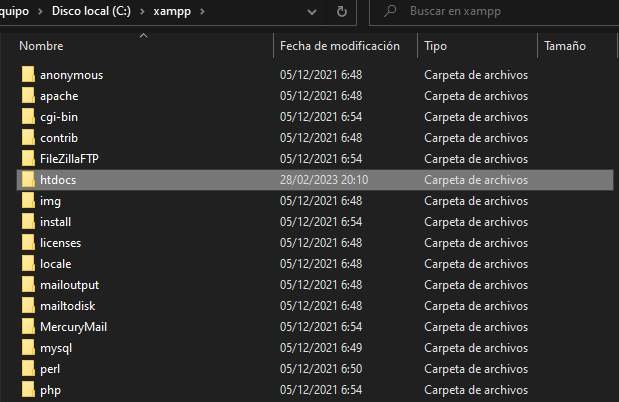
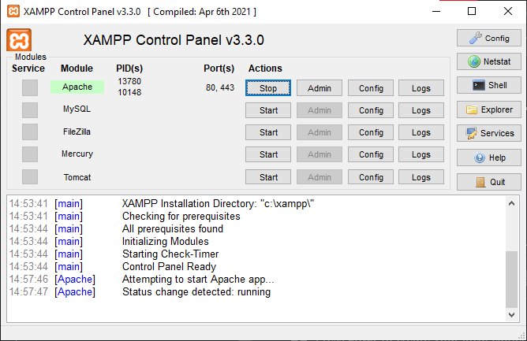

# API para Developer Test
:warning: Realizar estos pasos antes de iniciar la aplicación en `REACT`

## Lenguaje
>:heavy_check_mark: PHP

## Base de Datos
> :heavy_check_mark: **Planet Scale:** Base de datos MySQL online

## Servidor PHP Necesario
Se recomienda realizar con XAMPP (Utilizando versión v3.3.0)

### 1. Crear carpeta en `HTDOCS`
- Ingresar en la ruta \*xampp/htdocs/\*
- Nombrar como \*devtestAPI\*

### 2. Clonar repositorio en carpeta creada in `git bash`
    - git clone `https://github.com/adilmarruiz/devtestAPI`

### 3. Puesta en marcha del servidor
**Solo será necesario iniciar `APACHE`**
